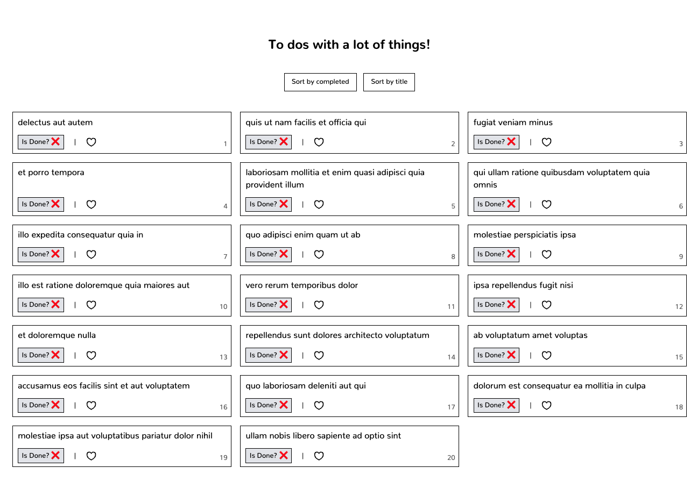

# Hi 👋 Welcome to the Intermediate React Course!

This is a project that I am doing with a group of people to help them improve some of their skills with React (mainly but not exclusively).
We will try to create an app that fetches some todos from an external API and apply some sorting. Also, we will use Zustand for state management, useQuery for data handling, TailwindCSS for styling, and much more!

## ⭐️ Deployment

- Final, most updated deploy is [here](https://tutorial-react-nivel-medio.vercel.app/).

- Deploy Class 1 [here](tutorial-react-nivel-medio-7kxbdm9v9-manuelsanchezweb.vercel.app).

## 🙋🏻‍♀️ Classes

The repo is divided into classes. You will see for example the folder `clase-1` with everything concerning `Fetch using useQuery, Skeleton ...`.

| #   | Date       | Content                                                                |
| --- | ---------- | ---------------------------------------------------------------------- |
| 1   | 12/04/2024 | **Fetch using useQuery, Skeleton, Isolate common global variables...** |
| 2   | 19/04/2024 | **Sorting / Escape from useEffect hell!**                              |
| 3   | TBD        | TBD                                                                    |
